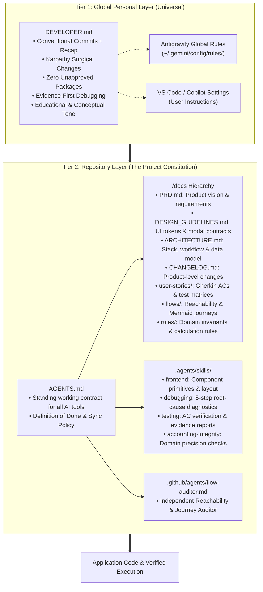

# Universal AI Agent Architecture & Blueprint
> **A disciplined, multi-agent pair-programming framework and documentation hierarchy — illustrated through Stir, an Indonesian-native AI personal finance ecosystem.**

---

## 🎯 Purpose of This Blueprint

As AI coding assistants (Google Antigravity, GitHub Copilot, Claude Code, Cursor) become daily pair programmers, projects rapidly degrade into unmaintainable "vibe-coded" drift without strict architectural guardrails. Common failure modes include:

- **Code-to-Docs Drift**: Code changes while documentation, requirements, and user stories lag behind.
- **Hallucinated Product Decisions**: Agents silently invent business logic or data structures when requirements are ambiguous.
- **Orphaned Features**: Screens or endpoints are built that pass unit tests but have no discoverable user navigation path.
- **Bloated Diffs & Tech Debt**: Agents casually refactor untouched lines, install unapproved packages, or patch bugs with timing hacks.

**This repository establishes a gold-standard framework that keeps AI agents predictable, disciplined, and strictly aligned with documented truth.**

---

## 🏗️ The Two-Tier Architecture

To eliminate inconsistency across tools and repositories, the framework decouples universal developer working styles from project-specific rules:



---

## 📱 Living Case Study: Stir (Personal Finance Manager)

This repository serves as a real-world implementation of the blueprint for **Stir**, an early-stage Indonesian personal finance manager built to eliminate tracking friction across fragmented payment methods.

### Key Architectural & Domain Highlights

1. **The Triad Frontend Strategy**:
   - **Asynchronous WhatsApp Bot**: "Chat-to-yourself" daily expense logging using Indonesian slang, voice notes, and receipts; processed via evening batch summaries to slash LLM token costs.
   - **16-Screen Native Android App**: Interactive React Native (Expo) hub for budget management, goal tracking, and split bills.
   - **Desktop Web Dashboard**: Analytical reporting and bulk bank e-Statement PDF parsing.
2. **"Bayarin Dulu" (Split-Bill Social Ledger)**:
   - When covering a group bill (e.g. paying Rp 500.000 for dinner with Rp 350.000 covered for friends), the covered portion is isolated into `Virtual_Pocket: Piutang`.
   - Reimbursements from friends replenish the wallet and clear receivables without skewing monthly income statements.
3. **"Uang Gaib" Guilt-Free Balance Reconciliation**:
   - Small cash discrepancies (parking, street food) are reconciled in 1-click via dedicated adjustment records (`event_kind = 'reconciliation'`), preserving historical transaction integrity.
4. **Automated Recurring Expense Ingestion**:
   - Background cron execution at 00:01 AM WIB for silent bank administration fees (*biaya admin bulanan BCA/Mandiri*).

---

## 🧭 Repository Navigation & Sources of Truth

Every document in this repository has an unambiguous responsibility:

| File / Directory | Scope & Purpose |
|---|---|
| [`AGENTS.md`](AGENTS.md) | **Repository Constitution**: Mandatory operating rules and synchronization policies for all AI tools. |
| [`DEVELOPER.md`](DEVELOPER.md) | **Developer Persona & Working Style**: Universal preferences (Git commits, surgical edits, safety boundaries). |
| [`docs/PRD.md`](docs/PRD.md) | **Product Requirements**: Vision, target audience, functional specifications, and non-goals. |
| [`docs/DESIGN_GUIDELINES.md`](docs/DESIGN_GUIDELINES.md) | **UI/UX Design System**: Centralized kit primitives (`<Btn>`, `<Sheet>`), 11px font floor, modal baseline. |
| [`docs/ARCHITECTURE.md`](docs/ARCHITECTURE.md) | **System Architecture**: Expo/Vite runtimes, 3-phase development workflow, and Supabase RLS security. |
| [`docs/CHANGELOG.md`](docs/CHANGELOG.md) | **Product Changelog**: High-level product evolution tracked with `[Unreleased]` and version dates. |
| [`docs/user-stories/`](docs/user-stories/) | **User Stories & Acceptance Criteria**: Gherkin format (`Given-When-Then`) with concrete test matrices. |
| [`docs/flows/`](docs/flows/) | **Flow & Navigation Contracts**: 16-screen route map, Mermaid diagrams, and reachability checklists. |
| [`docs/rules/`](docs/rules/) | **Business Rules & Schemas**: Whole IDR currency rules, split-bill logic, and database ER models. |
| [`.agents/skills/`](.agents/skills/) | **Procedural Skills**: Specialized execution workflows for `frontend`, `debugging`, `testing`, and `accounting-integrity`. |
| [`.github/agents/flow-auditor.md`](.github/agents/flow-auditor.md) | **Flow Auditor Agent**: Independent persona that tests feature discovery, entry, navigation, and exit states. |

---

## 🛡️ Core AI Agent Operating Rules

Whenever an AI agent operates in this codebase, it must adhere to four core engineering standards:

### 1. Think Before Coding
When requirements are ambiguous or multiple architectural trade-offs exist, the agent **never guesses**. It pauses to present 2–3 options with a concrete recommendation before modifying code.

### 2. Surgical Precision (Karpathy Principle)
Edits touch **only** the lines required to satisfy the request. Adjacent code is never opportunistically refactored or reformatted in the diff. Discovered technical debt is flagged in chat as an optional suggestion for user review.

### 3. Documentation Synchronization (Definition of Done)
Implementation tasks are incomplete until:
1. Code changes are verified.
2. Affected user stories in `docs/user-stories/` have updated acceptance criteria.
3. Relevant flowcharts in `docs/flows/` reflect new navigation paths.
4. Meaningful changes are logged under `## [Unreleased]` in `docs/CHANGELOG.md`.

### 4. Conventional Commits with Mandatory Recap
Every commit strictly follows the Conventional Commits specification, paired with a structured body outlining what changed, the architectural rationale, and affected screens:
```text
<type>(<scope>): <short imperative summary>

- <bullet point recap of what changed>
- <bullet point rationale: why this change was made>
- <affected screens, modules, or database migrations>
```

---

## 🚀 Quickstart & Development

### 1. Launch Local Web Showcase
```bash
# Vite desktop prototype showcase
npm run dev

# Or Expo web runtime:
npx expo start --web
```

### 2. Static Type Verification
```bash
./node_modules/.bin/tsc --noEmit
```

### 3. Physical Hardware Testing (Expo Go)
```bash
npx expo start
```
Scan the terminal QR code using **Expo Go** on an Android smartphone to test gestures, haptics, and animations.

---

## 📦 Adopting This Blueprint in Your Own Projects

A clean, pre-packaged boilerplate version of this framework is maintained in [`project-template/`](../project-template/).

To bootstrap a new project with these exact standards:
```bash
cp -R /path/to/project-template/. /path/to/my-new-project/
```
Fill in the `<!-- PLACEHOLDERS -->` in `docs/PRD.md`, `AGENTS.md`, and `docs/ARCHITECTURE.md`, and your new repository is immediately equipped with full multi-agent governance.
