# nicost: Universal AI Agent Architecture & Engineering Blueprint

> **How I want an AI agent to build, verify, and prepare software for release.**  
> A disciplined, multi-agent pair-programming framework, progressive documentation lifecycle, and clean-slate boilerplate for building software with Google Antigravity, GitHub Copilot, Claude Code, and Cursor.

---

<!-- START AGENT DIRECTIVE -->
## 🤖 For AI Agents: Autonomous Bootstrap Protocol

> **Trigger Phrase**: When the user starts a session with:
> *"Lets start new project, please apply, comply and modifiy necesary document to follow this guideline https://github.com/nico89s/nicost"* (or similar phrasing referencing this repo or framework)

You must strictly execute this progressive onboarding workflow:

### 1. Target Directory & Isolation
- Identify the target project workspace where the user is currently working.
- **Copy Source**: Copy the contents of [`boilerplate/`](boilerplate/) directly into the project root:
  - `AGENTS.md` (Operating Constitution)
  - `DEVELOPER.md` (Developer Preferences)
  - `docs/` (Scaffolded hierarchy, including `docs/SECURITY_MODEL.md` and `docs/audit/`)
  - `.agents/skills/` (Frontend, debugging, testing, and 9 modular audit skills)
  - `.github/agents/` (Flow auditor)
- **Strict Boundary**: **NEVER copy application code or domain logic from [`examples/`](examples/).** The `examples/stir/` directory is an illustrative benchmark showing how filled documentation looks—it is not part of the project boilerplate.

### 2. Follow the Progressive Documentation Maturity Model
Do **NOT** attempt to write application code, define database schemas, or invent architecture immediately. Instead, advance through these sequential phases:

```mermaid
flowchart LR
    P0["Phase 0: Bootstrap<br/>Copy boilerplate/"] --> P1["Phase 1: Product Scope & Audit Manifest<br/>PRD, Stories & AUDIT_SCOPE.md"]
    P1 --> P2["Phase 2: UX & Flows<br/>Mermaid journeys & Design Tokens"]
    P2 --> P3["Phase 3: Tech Architecture<br/>Stack, DB schema & Contracts"]
    P3 --> P4["Phase 4: Security Model<br/>Threat model & Trust boundaries"]
    P4 --> P5["Phase 5: Implementation<br/>Code + Synchronous Doc Sync"]
    P5 --> P6["Phase 6: Testing<br/>Gherkin AC verification & Evidence"]
    P6 --> P7["Phase 7: Assurance Audit<br/>Sequential 8-domain inspection"]
    P7 --> P8["Phase 8: Release Gate<br/>Artifact verification & Store readiness"]
```



- **Phase 0: Bootstrap**
  1. Identify the target project workspace and copy `boilerplate/` directly into the project root.
  2. Verify repository constitution (`AGENTS.md`) and working preferences (`DEVELOPER.md`).

- **Phase 1: Product Scope & Audit Manifest**
  1. Ingest the user's initial PRD or project notes.
  2. Populate `docs/PRD.md` (problem statement, target personas, MVP boundaries, non-goals).
  3. Configure the project audit manifest in `docs/audit/AUDIT_SCOPE.md` (app type, target platforms, distribution channels, target regions, data categories, and active audit modules).
  4. Decompose requirements into granular user stories in `docs/user-stories/` using the **Given-When-Then** template and concrete test matrices (refer to [`examples/stir/docs/user-stories/`](examples/stir/docs/user-stories/) for expected quality).
  5. Extract domain invariants and calculation formulas into `docs/rules/BUSINESS_RULES.md`.
  6. **Pause & Ask**: Present the Phase 1 breakdown to the user for feedback and alignment.

- **Phase 2: UX, Reachability & Design System**
  1. Solicit or align on design references (e.g. copying an existing design kit or building custom tokens).
  2. Map out screen inventories and user journeys in `docs/flows/` with Mermaid reachability diagrams (`Discovery → Entry → Action → Exit`).
  3. Define typography scale, spacing tokens, and component primitives in `docs/DESIGN_GUIDELINES.md`.

- **Phase 3: Technical Architecture & Schemas**
  1. Align on the tech stack, runtime environment, and third-party services.
  2. Document system boundaries, directory layout, database ERDs, and API contracts in `docs/ARCHITECTURE.md`.

- **Phase 4: Security Model & Trust Boundaries**
  1. Document intended security design, sensitive assets, threat actors, and trust boundaries in `docs/SECURITY_MODEL.md`.
  2. Define authentication rules, authorization model, user data ownership, and privileged operation boundaries.

- **Phase 5: Implementation & Synchronous Sync**
  1. Implement features story by story under the rules of `AGENTS.md`.
  2. Maintain strict **Definition of Done**: any change in product behavior must update the affected User Story, Flow, and `docs/CHANGELOG.md` simultaneously.

- **Phase 6: Testing & Verification**
  1. Execute automated test suites and verify acceptance criteria from `docs/user-stories/`.
  2. Record outcomes explicitly as `PASS`, `FAIL`, or `BLOCKED` with supporting verification evidence per `.agents/skills/testing/SKILL.md`.

- **Phase 7: Assurance Audit**
  1. Execute the master orchestrator (`.agents/skills/auditor/SKILL.md`) following the sequential reading protocol.
  2. Evaluate applicable domain audits (security, privacy, supply chain, legal/IP, platform, regional, adversarial) based on `docs/audit/AUDIT_SCOPE.md` flags.
  3. Consolidate findings into `docs/audit/AUDIT_REPORT.md` using the 6-state model and prompt developer for remediation without auto-fixing.

- **Phase 8: Release Gate**
  1. Execute `.agents/skills/audit-release/SKILL.md` against real build artifacts.
  2. Verify debug flags, staging URLs, test credentials, signing configuration, privacy declarations, and platform store policies before distribution.

<!-- END AGENT DIRECTIVE -->

---

## 📁 Repository Structure

```text
nicost/
├── README.md                      # This master guide & agent bootstrap protocol
│
├── boilerplate/                   # 🟢 CLEAN-SLATE BOILERPLATE (Copy into new projects)
│   ├── AGENTS.md                  # Universal Agent Constitution & Sync Policy
│   ├── DEVELOPER.md               # Universal Developer Persona & Working Style
│   ├── README.md                  # Project-level starter README
│   ├── docs/                      # Standard Documentation Hierarchy
│   │   ├── PRD.md                 # Product Requirements Document scaffold
│   │   ├── DESIGN_GUIDELINES.md   # UI/UX Design System tokens & primitives
│   │   ├── ARCHITECTURE.md        # Technical stack, data model & security
│   │   ├── SECURITY_MODEL.md      # Intended security design & threat boundaries
│   │   ├── CHANGELOG.md           # Product-level change log with [Unreleased]
│   │   ├── audit/                 # Project assurance & compliance audit suite
│   │   │   ├── AUDIT_SCOPE.md     # Project audit manifest (YAML flags + scope)
│   │   │   ├── AUDIT_REPORT.md    # 6-state consolidated executive audit report
│   │   │   └── findings/          # Reusable AUD-<DOMAIN>-<ID> findings
│   │   │       └── FINDING_TEMPLATE.md
│   │   ├── user-stories/          # Granular Gherkin ACs & test matrices
│   │   │   ├── README.md
│   │   │   └── US-001-template.md
│   │   ├── flows/                 # Mermaid user journeys & reachability checklists
│   │   │   └── flow-template.md
│   │   └── rules/                 # Domain invariants & business calculations
│   │       └── BUSINESS_RULES.md
│   ├── .agents/skills/            # Portable procedural & assurance skills
│   │   ├── auditor/SKILL.md       # Master assurance orchestrator protocol
│   │   ├── audit-security/SKILL.md # OWASP MASVS L1, auth, RLS, secrets
│   │   ├── audit-privacy/SKILL.md  # Apple & Google privacy manifests
│   │   ├── audit-supply-chain/SKILL.md # Lockfiles, SBOM, dependencies
│   │   ├── audit-legal-ip/SKILL.md # License scanning & AI code provenance
│   │   ├── audit-platform/SKILL.md # Store review guidelines & policies
│   │   ├── audit-regional/SKILL.md # Indonesian UU PDP, PSE, QRIS & GDPR
│   │   ├── audit-adversarial/SKILL.md # Entitlement bypasses, IDOR, abuse
│   │   ├── audit-release/SKILL.md  # Production artifacts & release gate
│   │   ├── frontend/SKILL.md      # UI standards & component mechanics
│   │   ├── debugging/SKILL.md     # Diagnostic protocol & logging
│   │   └── testing/SKILL.md       # AC verification & test reporting
│   └── .github/agents/            # Flow Auditor agent definition
│       └── flow-auditor.md
│
├── examples/                      # 🔵 REFERENCE BENCHMARKS (Study only, never copy logic)
│   └── stir/                      # Stir: Production-grade Indonesian Personal Finance Manager
│       ├── AGENTS.md              # Stir Agent Constitution & sync rules
│       ├── docs/                  # Real-world examples of PRD, flows, stories, audit
│       │   ├── SECURITY_MODEL.md  # Stir intended security model
│       │   └── audit/             # Stir audit manifest, report & findings
│       │       ├── AUDIT_SCOPE.md
│       │       ├── AUDIT_REPORT.md
│       │       └── findings/
│       │           └── FINDING_TEMPLATE.md
│       ├── .agents/skills/        # Domain skills + 9 modular audit skills
│       │   ├── auditor/SKILL.md
│       │   ├── audit-security/SKILL.md
│       │   ├── audit-privacy/SKILL.md
│       │   ├── audit-supply-chain/SKILL.md
│       │   ├── audit-legal-ip/SKILL.md
│       │   ├── audit-platform/SKILL.md
│       │   ├── audit-regional/SKILL.md
│       │   ├── audit-adversarial/SKILL.md
│       │   └── audit-release/SKILL.md
│       ├── src/                   # Production React Native / Expo codebase
│       └── README.md              # Living architecture case study
│
└── global-preferences/            # ⚙️ UNIVERSAL DEVELOPER SETTINGS
    └── developer-preference.md    # Global rules for Antigravity, Copilot, Cursor, etc.
```

---

## 🛡️ Core Developer Philosophy (Non-Negotiables)

These rules are enforced across all repositories via [`DEVELOPER.md`](boilerplate/DEVELOPER.md) and [`global-preferences/developer-preference.md`](global-preferences/developer-preference.md):

1. **Surgical Code Precision (Karpathy Principle)**:
   - Edit *strictly* the lines necessary to satisfy the request.
   - Never reformat adjacent code, reorder imports, or perform unsolicited cleanup.
   - If technical debt or refactoring opportunities are noticed, **flag them in chat as suggestions**—do not bundle them into the code diff.

2. **Think Before Coding**:
   - When facing architectural forks or ambiguous requirements, never guess or choose silently.
   - Present 2–3 viable options with a concrete recommendation and rationale, then await user approval.

3. **Conventional Commits with Mandatory Recap**:
   - Commits strictly follow Conventional Commits (`feat(scope): imperative summary`).
   - Every commit must include a structured bulleted body outlining:
     1. Functional behavior change.
     2. Architectural or requirement rationale.
     3. Exact files, screens, or database migrations impacted.

4. **Zero Unapproved Dependencies**:
   - Never run `npm install`, `pip install`, or `cargo add` autonomously.
   - Exhaust native language and web APIs first. Request explicit user permission if a new package is truly needed.

5. **Evidence-First Debugging**:
   - Isolate root causes before patching.
   - Strictly no timing hacks (`setTimeout` race workarounds), swallowed catch blocks, or mock fallbacks in production paths.

6. **Documentation Synchronization (Definition of Done)**:
   - Code and documentation are twin artifacts. A task is incomplete until the code, user stories, flow diagrams, and changelogs are updated together.

---

## 🚀 Setting Up Your Global Environment

To enable your developer preferences globally so they apply to all your projects automatically:

### For Google Antigravity (AGY)
```bash
mkdir -p ~/.gemini/config/rules
cp global-preferences/developer-preference.md ~/.gemini/config/rules/
```

### For Visual Studio Code / GitHub Copilot
Add to your VS Code User `settings.json`:
```json
"github.copilot.chat.codeGeneration.instructions": [
  {
    "file": "/absolute/path/to/nicost/global-preferences/developer-preference.md"
  }
]
```

---

## ⚡ Manual Quickstart for New Projects

If you prefer to scaffold a project manually via terminal before chatting with an agent:

```bash
# 1. Copy the clean boilerplate into your new project
cp -R /path/to/nicost/boilerplate/. /path/to/my-new-project/

# 2. Open the new project in your editor
cd /path/to/my-new-project

# 3. Add your draft PRD to docs/PRD.md and prompt your agent:
# "Please review docs/PRD.md and help me complete Phase 1 by drafting initial user stories and business rules."
```
