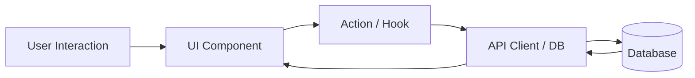

# System Architecture

## Changelog
- **YYYY-MM-DD**: Initial architecture document established.

This document describes the technical structure, runtime stack, data flow, security boundaries, and architectural decision records (ADRs).

---

## 1. Technology Stack

- **Frontend / Client**: [e.g. React Native / Next.js / TypeScript]
- **Routing & Navigation**: [e.g. Expo Router / Next.js App Router]
- **State Management**: [e.g. React Query / Zustand / Context]
- **Backend / Database**: [e.g. Supabase / PostgreSQL / SQLite]
- **Styling**: [e.g. Tailwind CSS / NativeWind]

---

## 2. Directory Structure

```text
src/ (or app/)
├── components/                       # Shared reusable UI primitives and widgets
├── lib/                              # Core business engines, utility helpers, and API clients
├── hooks/                            # Custom state and lifecycle hooks
└── ...
```

---

## 3. Data Flow & State Lifecycle



---

## 4. Security & Isolation Boundaries

- **Tenant Isolation**: How is user data isolated? (e.g. Row Level Security policies checking `auth.uid() = user_id`)
- **Secrets Management**: Public keys vs private keys; sensitive credentials never bundled in client code.
- **Input Sanitization**: Validation schemas (e.g. Zod) applied before database persistence.

---

## 5. Architectural Decisions (ADR)

### ADR-001: [Title of First Major Decision]
- **Status**: [Accepted / Proposed]
- **Context**: [Why did this decision need to be made?]
- **Decision**: [What was chosen?]
- **Consequences**: [Trade-offs, benefits, and maintenance overhead]
