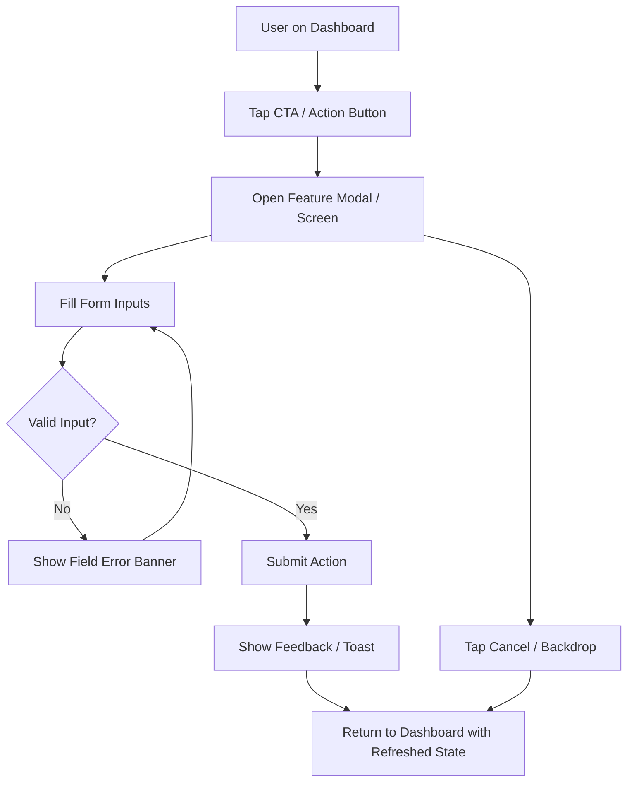

# Feature Flow: [Feature Name]

## Changelog
- **YYYY-MM-DD**: Documented initial flow.

## Purpose
Describe the user goal and end-to-end journey represented by this flow.

## Related User Stories
- [`US-001`](../user-stories/US-001-template.md)

---

## 🗺️ Mermaid Flowchart

---

## 🔍 Reachability & Discovery Contract

- **Discovery**: How does the user discover this feature? (e.g. Floating action button on Dashboard)
- **Primary Entry Point**: Dashboard screen CTA.
- **Direct-URL Policy**: Feature must be reachable via normal UI navigation. Direct URL access alone does not satisfy integration criteria.
- **Cancellation**: Backdrop tap or explicit cancel dismisses the view without saving.
- **Return Destination**: Returns user to the originating screen with updated state.
