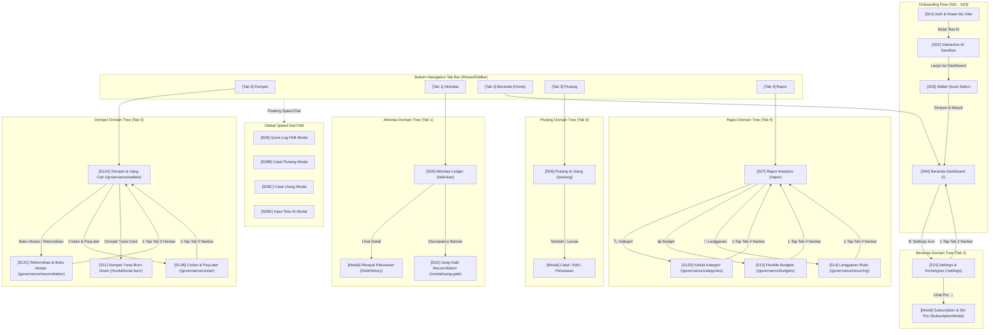

# Stir App 16-Screen Navigation Wireframe & Map

## Changelog
- **2026-09-17**: Standardized Tab 0 Domain Terminology to "Kantong" & "Uang Tunai" (`docs/architecture/navigation-wireframe.md`, `app/(tabs)/_layout.tsx`, `lib/navigationDomain.ts`): updated Tab 0 navigation metadata and wireframe diagrams from "Dompet" to "Kantong" and cash modal reference to "Uang Tunai".
- **2026-09-14**: Streamlined to Pure 1-Deep Navigation & Floating Stir Pro Modal (`docs/architecture/navigation-wireframe.md`, `app/(tabs)/_layout.tsx`, `components/SubscriptionModal.tsx`, `app/settings.tsx`, `app/governance/*.tsx`): eliminated floating `<SubPageFooter>` back buttons from all sub-pages to restore full vertical screen height; enabled 1-tap navbar root return (tapping the currently active tab icon navigates directly back to the parent domain root); prevented tab bar icon re-animation jumps on intra-domain sub-page transitions by caching layout width and suppressing spring physics when active tab index is unchanged; and transformed `[S16]` Stir Pro from a stacked sub-page into a floating slide-up modal overlay (`SubscriptionModal`) accessible directly from `[S15]` Settings.
- **2026-09-14**: Consolidated to Strict Single-Parent Tree Navigation (`docs/architecture/navigation-wireframe.md`, `app/governance/wallets.tsx`, `app/settings.tsx`, `app/governance/cicilan.tsx`): removed duplicate cross-domain entry points (e.g. Kategori/Budget/Recurring removed from Wallets and Settings) to ensure each sub-page lives strictly under its dedicated parent tab domain with 1-to-1 active navbar highlighting: Tab 0 (Dompet $\to$ Rekonsiliasi, Cicilan), Tab 4 (Rapor $\to$ Kategori, Budget, Langganan), and Tab 2 (Beranda $\to$ Settings $\to$ Pro).
- **2026-09-14**: Integrated Complete In-App Navigation Flow & Lower Thumb Zone Controls (`lib/navigationDomain.ts`, `components/kit/SubPageFooter.tsx`, `app/(tabs)/index.tsx`, `app/(tabs)/rapor.tsx`, `app/governance/*.tsx`, `app/settings.tsx`, `app/subscription.tsx`): added native in-app entry points to Settings (`⚙️`), Kelola Kategori, Flexible Budgets, Langganan Rutin, Cicilan & PayLater, and Stir Pro without requiring the developer side drawer; mapped `/governance/cicilan` to Tab 0 (`Dompet`) and `/governance/categories`, `/governance/budgets`, `/governance/recurring` to Tab 4 (`Rapor`); removed legacy top-header bars across all sub-pages; and anchored all back navigation into `<SubPageFooter>` in the lower thumb zone ($D_{min}$, $W_{max}$).
- **2026-09-14**: Implemented Fitts's Law Thumb Ergonomics & Navigation Domain Architecture (`lib/navigationDomain.ts`, `components/kit/SubPageFooter.tsx`, `app/(tabs)/_layout.tsx`): resolved bottom navbar width layout jumps across all governance screens by adding `relative` containment to `tab-shell-container` and defensive `max-w-md mx-auto` clamping to `SharedTabBar`; integrated domain-aware active tab resolution (`getActiveTabFromPath`) mapping sub-pages (e.g. `[S12C]` Rekonsiliasi Bank to `[S12A]` Dompet domain) preventing false fallback to Home (`/`); and introduced `<SubPageFooter>` anchoring navigation and primary CTA actions into the lower natural thumb zone ($D_{min}$, $W_{max}$).
- **2026-09-09**: Added `[S12D]` Kelola Kategori (`app/governance/categories.tsx`) to Group D (Governance & Settings Hubs) and Side Drawer Navigation. Documented 2-level hierarchy, 40-character max name, non-alphabet emoji selector, 40-shade color palette, alphabetical sorting, parent deletion guardrail, and automatic transaction re-categorization to undeletable "Other" (🪙).
- **2026-09-08**: Replaced docked navbar FAB with floating bottom-right Speed Dial (`components/FabSpeedDial.tsx`) featuring auto-hide on scroll-down (smooth sliding down `translate-y-24 opacity-0`), instant reveal on scroll-up, and 3-second idle reappear timer. Reorganized bottom navbar (`SharedTabBar`) into 5 items: Dompet (far-left `/governance/wallets`), Aktivitas, Beranda (center elevated white circular pill with flat lime home icon), Piutang, and Rapor.
- **2026-09-08**: Added `[S12C]` Buku Mutasi & Rekonsiliasi Bank (`app/governance/reconciliation.tsx`) to Group D (Governance & Settings Hubs) and updated `[S12A]` wallet context menu action to route to `[S12C]` with wallet filter. Documented passbook ledger, running balance computation, 4-grid financial summary, and interactive AI Bank Settlement upload modal with 3-way match audit.
- **2026-09-06**: Updated `[S06]` Social Ledger wireframe: documented view mode switch (Piutang vs Utang), 3-filter pill bar (Belum Lunas, Lunas, Semua), 6 centered modals (Catat Piutang, Catat Utang, Edit Piutang, Edit Utang, Terima Bayar, Bayar Utang, Ikhlasin, Konfirmasi Hapus), inline `DebtHistory` transaction drawer, and global `LedgerReview` confirmation modal.
- **2026-09-05**: Updated `[S12A]` Dompet & Uang Cair interaction pathways: documented anchored context menu popover (Lihat Riwayat Transaksi navigating with wallet filter to `S05` Aktivitas, Edit Akun centered modal, Catat Tunai Burn-down `S11`, Hapus Akun centered modal with zero-balance confirmation and non-zero balance financial reduction warning), plus centered Add Wallet modal with 12 SVG brand logos, 18-emoji palette, and 3-char input constraint.

## Overview
This document details the complete 16-screen navigation graph, route pathways, user triggers, and page-by-page wireframe flow for Stir (`S01` through `S16`), structured around **strict single-parent tree domains** to guarantee clear cognitive orientation and 1-to-1 bottom navbar state matching.

---

## Visual Navigation Graph (Mermaid Diagram)

---

## Complete Route Summary Table

| Screen ID | Screen Name | App Route | Domain Tab | How to Reach (Entry Trigger) | Sub-Page Exit Pathway |
|---|---|---|---|---|---|
| **S01** | Auth & "Roast My Vibe" | `app/onboarding.tsx` | — | App start (un-onboarded) / `/onboarding` | `S02` (via *"Mulai Test AI"*) |
| **S02** | Interactive AI Sandbox | `app/onboarding.tsx` | — | From `S01` | `S03` (via *"Lanjut ke Dashboard"*), `S01` |
| **S03** | Wallet Quick-Select Grid | `app/onboarding.tsx` | — | From `S02` | `S04` (via *"Simpan & Masuk"* or *"Lewati"*) |
| **S04** | Beranda Dashboard | `app/(tabs)/index.tsx` | Tab 2 (`/`) | Bottom Navbar Tab 2 / Onboarding finish | ⚙️ $\to$ `/settings` (`S15`) |
| **S05** | Aktivitas Ledger & Search | `app/(tabs)/aktivitas.tsx` | Tab 1 (`/aktivitas`) | Bottom Navbar Tab 1 | In-place modals (`DebtHistory`) |
| **S06** | Social Ledger (Piutang) | `app/(tabs)/piutang.tsx` | Tab 3 (`/piutang`) | Bottom Navbar Tab 3 | In-place modals (Pelunasan/Catat) |
| **S07** | Rapor Analytics & Wishlists | `app/(tabs)/rapor.tsx` | Tab 4 (`/rapor`) | Bottom Navbar Tab 4 | `S12D`, `S13`, `S14` |
| **S08** | Quick-Log FAB Modal | `app/modal/quick-log.tsx` | Global | Speed Dial (*"Tambah Keluar"*, *"Tambah Masuk"*, *"Transfer"*) | Dismiss to active tab |
| **S08B** | Catat Piutang Modal | `app/modal/catat-piutang.tsx` | Global | Speed Dial (*"Catat Piutang"*) / `S06` button | Dismiss to active tab |
| **S08C** | Catat Utang Modal | `app/modal/catat-utang.tsx` | Global | Speed Dial (*"Catat Utang"*) / `S06` button | Dismiss to active tab |
| **S08D** | Input Teks AI Modal | `app/modal/ai-log.tsx` | Global | Speed Dial (*"Input Teks AI"*) | Dismiss to active tab |
| **S09** | Catch-Up Batch Reader | `app/modal/catch-up.tsx` | Global | `/modal/catch-up` / Bank SMS import | Dismiss to active tab |
| **S10** | Uang Gaib Reconciliation | `app/modal/uang-gaib.tsx` | Tab 1 | Discrepancy banner on `S05` Aktivitas / S12C link | `router.back()` |
| **S11** | Dompet Tunai Burn-Down | `app/modal/tunai-burn.tsx` | Tab 0 | Dompet Tunai card on `S12A` Wallets | `router.back()` |
| **S12A** | Dompet & Uang Cair | `app/governance/wallets.tsx` | Tab 0 (`/governance/wallets`) | Bottom Navbar Tab 0 | `S12C` (Mutasi), `S12B` (Cicilan) |
| **S12B** | Ruang Cicilan & PayLater | `app/governance/cicilan.tsx` | Tab 0 (`/governance/cicilan`) | Menu Terkait on `S12A` Dompet | 1-Tap Tab 0 Navbar $\to$ `/governance/wallets` |
| **S12C** | Buku Mutasi & Rekonsiliasi | `app/governance/reconciliation.tsx` | Tab 0 (`/governance/reconciliation`) | Menu Terkait on `S12A` Dompet / Wallet context popover | 1-Tap Tab 0 Navbar $\to$ `/governance/wallets` |
| **S12D** | Kelola Kategori | `app/governance/categories.tsx` | Tab 4 (`/governance/categories`) | "🏷️ Kategori" on `S07` Rapor | 1-Tap Tab 4 Navbar $\to$ `/rapor` |
| **S13** | Flexible Budget Hub | `app/governance/budgets.tsx` | Tab 4 (`/governance/budgets`) | "📊 Budget" on `S07` Rapor | 1-Tap Tab 4 Navbar $\to$ `/rapor` |
| **S14** | Recurring Manager | `app/governance/recurring.tsx` | Tab 4 (`/governance/recurring`) | "🔄 Langganan" on `S07` Rapor | 1-Tap Tab 4 Navbar $\to$ `/rapor` |
| **S15** | Settings & Archetypes | `app/settings.tsx` | Tab 2 (`/settings`) | ⚙️ Icon on `S04` Beranda | 1-Tap Tab 2 Navbar $\to$ `/` (Beranda) |
| **S16** | Subscription & Stir Pro Modal | `components/SubscriptionModal.tsx` | Tab 2 (Overlay) | "Lihat Pro →" on `S15` Settings | Tap Batal / Backdrop to dismiss |

---

## Detailed Page-by-Page Breakdown

### Group A: Onboarding Flow (S01–S03)
- **`[S01]` Auth & Roast My Vibe** (`app/onboarding.tsx` - Step 1)
  - *Entry:* Default screen when app launches without active onboarded session, or direct route `/onboarding`.
  - *Exit:* Pressing *"Mulai Test AI"* advances to `S02`.

- **`[S02]` Interactive AI Sandbox** (`app/onboarding.tsx` - Step 2)
  - *Entry:* Advanced from `S01` or selecting Step 2 pill.
  - *Exit:* Pressing *"Lanjut ke Dashboard"* advances to `S03`. Pressing Step 1 pill returns to `S01`.

- **`[S03]` Wallet Quick-Select Grid** (`app/onboarding.tsx` - Step 3)
  - *Entry:* Advanced from `S02` or selecting Step 3 pill.
  - *Exit:* Pressing *"Simpan & Masuk"* or *"Lewati / Atur Nanti"* sets onboarded flag and navigates to `S04` Beranda.

---

### Group B: Main Bottom Navbar Tabs (S04–S07)
- **`[S04]` Beranda Dashboard** (`app/(tabs)/index.tsx`)
  - *Entry:* Post-onboarding landing page, pressing **Beranda** (Tab 1) on sticky bottom navbar, or route `/(tabs)`.
  - *Exits:*
    - Tap bottom navbar tabs for `S05`, `S06`, `S07`.
    - Tap center **`+`** FAB button on bottom navbar or tap Roast Banner card $\rightarrow$ `S08` Quick-Log Modal.
    - Tap *"Lihat Semua"* next to recent transactions $\rightarrow$ `S05` Aktivitas.
    - Tap Uang Cair card or Tagihan PayLater card $\rightarrow$ `S12` Wallets Hub.

- **`[S05]` Aktivitas Ledger & Search** (`app/(tabs)/aktivitas.tsx`)
  - *Entry:* Pressing **Aktivitas** (Tab 2) on sticky bottom navbar or pressing *"Lihat Semua"* on `S04`.
  - *Exits:*
    - Tap bottom navbar tabs for `S04`, `S06`, `S07`.
    - Tap center **`+`** FAB button $\rightarrow$ `S08` Quick-Log Modal.
    - Tap Discrepancy Alert Banner (*"⚠️ Ada selisih Rp 50.000..."*) $\rightarrow$ `S10` Uang Gaib Reconciliation.

- **`[S06]` Social Ledger / Piutang & Utang** (`app/(tabs)/piutang.tsx`)
  - *Entry:* Pressing **Piutang** (Tab 3) on sticky bottom navbar.
  - *View Switcher:* Top segmented toggle switching between **Uangku di orang** (Piutang / AR) and **Utangku ke orang** (Utang / AP).
  - *Filter Bar:* 3-state pills: `Belum Lunas` (outstanding balance > 0), `Lunas` (settled, forgiven, or voided), and `Semua`.
  - *Interactions & Centered Modals:*
    - Tap *"+ Catat Piutang"* $\rightarrow$ Centered modal with debtor name, nominal (IDR formatted), source wallet selector, notes, and date.
    - Tap *"+ Catat Utang"* $\rightarrow$ Centered modal with dual-mode selector (`Ditalangi Belanja` vs `Pinjam Dana / Tunai`), creditor name, nominal, category picker, and date.
    - Tap *"Tagih WA"* $\rightarrow$ Opens external WhatsApp prefilled message URL (`https://wa.me/?text=...`) without hardcoded credentials.
    - Tap *"Terima Bayar"* $\rightarrow$ Centered modal with partial/full settlement amount, deposit wallet dropdown, and date.
    - Tap *"Bayar Utang"* $\rightarrow$ Centered modal with repayment amount, withdrawal wallet dropdown, category picker, and date.
    - Tap *"Ikhlasin"* (available when age > 30 days) $\rightarrow$ Centered modal with forgiven amount, category picker, and zero cash movement.
    - Tap *"Edit"* / *"Lihat Detail"* $\rightarrow$ Centered edit modal embedding `DebtHistory` drawer showing all linked transactions (origin and repayments/write-offs) with inline "Koreksi" and "Batalkan" actions.
    - Tap *"Hapus"* $\rightarrow$ Centered deletion confirmation dialog.
  - *Global Ledger Review:*
    - Any mutation trigger opens `LedgerReview` modal dialog showing previewed impact (wallet balances before/after/delta, affected transaction reportable amounts, and debt balances) with explicit confirmation before executing commit.
  - *Exits:*
    - Tap bottom navbar tabs for `S04`, `S05`, `S07`.
    - Tap center **`+`** FAB button $\rightarrow$ `S08` Quick-Log Modal.

- **`[S07]` Rapor Analytics & Wishlists** (`app/(tabs)/rapor.tsx`)
  - *Entry:* Pressing **Rapor** (Tab 4) on sticky bottom navbar.
  - *Exits:*
    - Tap bottom navbar tabs for `S04`, `S05`, `S06`.
    - Tap center **`+`** FAB button $\rightarrow$ `S08` Quick-Log Modal.

---

### Group C: Modals & Action Sheets (S08–S11)
- **`[S08]` Quick-Log FAB Modal** (`app/modal/quick-log.tsx`)
  - *Entry:* Center **`+`** FAB icon on bottom navbar from any main tab (`S04`–`S07`) or roast banner on `S04`.
  - *Exit:* Submitting transaction or tapping close dismisses modal (`router.back()`), returning to active tab.

- **`[S09]` Catch-Up Batch Reader** (`app/modal/catch-up.tsx`)
  - *Entry:* Route `/modal/catch-up` or bank SMS batch import trigger.
  - *Exit:* Submitting extracted items or closing dismisses modal (`router.back()`), returning to parent tab.

- **`[S10]` Uang Gaib Reconciliation** (`app/modal/uang-gaib.tsx`)
  - *Entry:* Pressing discrepancy warning alert on `S05` Aktivitas (*"⚠️ Ada selisih..."*).
  - *Exit:* Completing Fast Mode balance adjust or Sherlock audit scan dismisses modal (`router.back()`) returning to `S05`.

- **`[S11]` Dompet Tunai Burn-Down** (`app/modal/tunai-burn.tsx`)
  - *Entry:* Tapping Dompet Tunai card on `S12` Wallets or route `/modal/tunai-burn`.
  - *Exit:* Saving cash breakdown percentages dismisses modal (`router.back()`) returning to `S12`.

---

### Group D: Governance & Settings Hubs (S12A/S12B/S12C–S16)
- **`[S12A]` Dompet & Uang Cair** (`app/governance/wallets.tsx`)
  - *Entry:* Uang Cair card on `S04` Beranda or header link on `S12B`.
  - *Interactions & Overlays:*
    - Press *"+ Tambah"* $\rightarrow$ Centered Add Wallet pop-up modal (`rounded-3xl bg-surface`, 12-brand SVG grid, 18-emoji palette, max 3-char code input, `Batal`/`Simpan` row).
    - Tap any *Wallet Card* $\rightarrow$ Anchored Context Menu Popover (`bg-ink/40 backdrop-blur-[1px]` with target row clone elevated by `ring-2 ring-lime/40`):
      - *"Rekonsiliasi & Mutasi"* $\rightarrow$ `S12C` Buku Mutasi & Rekonsiliasi filtered by `walletId=<id>&wallet=<name>`.
      - *"Edit Akun Dompet"* $\rightarrow$ Centered Edit Wallet pop-up modal.
      - *"Catat Tunai Burn-down"* (cash only) $\rightarrow$ `S11` Tunai Burn Modal.
      - *"Hapus Dompet"* $\rightarrow$ Centered Deletion Dialog (Warning with balance reduction for balance > 0; confirmation for balance == 0).
  - *Exits:*
    - Press *"← Beranda"* $\rightarrow$ `S04` Beranda.
    - Press *"Cicilan →"* header link $\rightarrow$ `S12B` Ruang Cicilan.
    - Tap *Governance Hubs* grid $\rightarrow$ `S12C` Rekonsiliasi, `S12B` Cicilan, `S13` Budget Hub, `S14` Recurring Manager.

- **`[S12B]` Ruang Cicilan & PayLater** (`app/governance/cicilan.tsx`)
  - *Entry:* Tagihan PayLater card on `S04` Beranda or header link on `S12A`.
  - *Exits:*
    - Press *"← Beranda"* $\rightarrow$ `S04` Beranda.
    - Press *"Dompet →"* header link $\rightarrow$ `S12A` Dompet & Uang Cair.
    - Governance hub links $\rightarrow$ `S13` Budget Hub, `S14` Recurring Manager.

- **`[S12C]` Buku Mutasi & Rekonsiliasi** (`app/governance/reconciliation.tsx`)
  - *Entry:* Wallet context menu *"Rekonsiliasi & Mutasi"* on `S12A`, Governance Hubs grid link, or Side Drawer shortcut.
  - *Interactions & Features:*
    - *Wallet Switcher:* Horizontal scrollable pills for all liquid accounts (`BCA Tahapan`, `GoPay`, `Mandiri`, `Cash`) with brand logos and current balance.
    - *Period Filter:* Switcher pills for `Bulan ini`, `Bulan lalu`, `60 hari terakhir`, and `Pilih tanggal` with dual calendar inputs and explicit *"Terapkan Tanggal"* CTA.
    - *Passbook Summary Card:* 4-grid metric display showing Saldo Awal, Total Masuk (+), Total Keluar (-), Saldo Akhir App, and discrepancy badge (`✨ Cocok (Rp 0)` or `⚠️ Selisih Rp X`).
    - *Passbook Ledger List:* Chronological transactions with real-time running balance (`Saldo Berjalan`), macro/sub category, in/out colored amounts, and 1-tap interactive verification status toggle (`✅ Cocok` $\leftrightarrow$ `⏳ Belum`).
    - *Action Toolbar:* Main CTA *"✨ Unggah Mutasi (AI)"*, *"Cocokkan Semua"*, *"+ Catat Baru"*, and inline *"👻 Uang Gaib"* balance adjustment.
    - *Interactive AI Settlement Upload Modal:* File dropzone supporting PDF/CSV/images + 1-click sample statement loaders (`BCA Tahapan E-Statement`, `GoPay Monthly Mutation`), simulated scanning animation, and 3-way match breakdown (Belum Ada di Stir with 1-tap `+ Catat ke Stir`, Sudah Cocok, Hanya di Stir).
  - *Exits:*
    - Press *"← Dompet"* $\rightarrow$ `S12A` Dompet & Uang Cair.
    - Press *"Uang Gaib 👻"* $\rightarrow$ `S10` Uang Gaib Reconciliation modal (`/modal/uang-gaib`).
    - Bottom tab bar $\rightarrow$ `S04` Beranda, `S05` Aktivitas, `S06` Piutang, `S07` Rapor, `S08` Quick-Log FAB.

- **`[S13]` Flexible Budget Hub** (`app/governance/budgets.tsx`)
  - *Entry:* Header link on `S12` or `S14`.
  - *Exits:*
    - Press *"← Guardrails Hub"* $\rightarrow$ `S12` Wallets.
    - Press *"Recurring & Admin Fees →"* $\rightarrow$ `S14` Recurring Manager.

- **`[S14]` Recurring Manager & Silent Admin Fees** (`app/governance/recurring.tsx`)
  - *Entry:* Header link on `S13` or `S15`.
  - *Exits:*
    - Press *"← Flexible Budgets"* $\rightarrow$ `S13` Budget Hub.
    - Press *"Settings & Archetypes →"* $\rightarrow$ `S15` Settings.

- **`[S15]` Settings & Archetype Config** (`app/settings.tsx`)
  - *Entry:* Header link on `S14`.
  - *Exits:*
    - Press *"← Kembali ke App"* $\rightarrow$ `S04` Beranda.
    - Press *"Pro & Monetization →"* $\rightarrow$ `S16` Subscription.

- **`[S16]` Subscription & IG Story Share Cards** (`app/subscription.tsx`)
  - *Entry:* Header link on `S15`.
  - *Exits:*
    - Press close button $\rightarrow$ dismisses modal back to `S15` (`router.back()`).
    - Press *"Bagikan ke IG Story / WA 📲"* $\rightarrow$ native OS share sheet.
